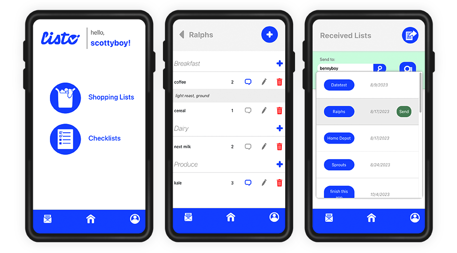

# Listo

An application for families/house-mates to create and share shopping and organization lists.

* Ability to share lists allows for easy coordination on shoppinng/planning
* All your lists in one place, no scrap paper needed
* Grocery items organized by category allows for efficient shopping experience

## Table of Contents
- [Installation](#installation)
- [Demonstration](#demonstration)
- [Framework](#framework)

## Installation
After cloning or downloading repo, run ```npm i``` in the terminal to install dependencies, followed by ```npm run develop``` to start the development server.

## Demonstration




The clean, navigable UI creates an intuitive and easy user experience

## Framework
This is a MERN stack application, built using a RESTful API architectural style